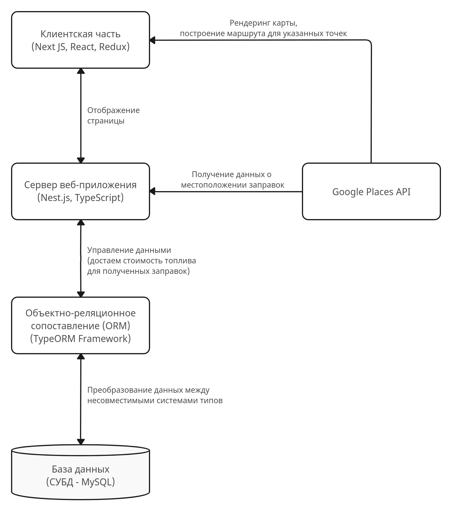

<h1 align="center">Летняя школа СПбГУ</h1>

Создание сервиса для портала Cargotime с возможностью построения экономически выгодного по стоимости маршрута с учетом дозаправок и оценивания стоимости поездки.

---

## Архитектура проекта

## Использование

(чуть позже)

## Технологии в проекте

- Node.js v18.16.1
- Npm v9.5.1
- Sass v3.7.4
- TypeScript v4.5.4

## Техническое описание проекта

### Использование Sass в WebStorm: 

`File > Settings`, в открывшемся окошке перейти в раздел `Tools > File Watchers`, нажать на зеленый плюсик справа и
выбрать
`Sass\SCSS`.

### Использование TypeScript в WebStorm: 

Достаточно создать файл с расширением `.ts`. Для транспиляции TypeScript в JavaScript надо прописать в
терминале `tsc ${путь до файла}`. Чтобы настроить свою конфигурацию, в терминал надо прописать `tsc --init`, появится
файл `tsconfig.json`, в котором можно выставить свои настройки.
